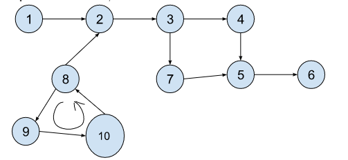

# Detect cycle in Directed graph

In a directed graph, cycles occur when there is a path from a node back to itself through a sequence of directed edges.

## Key Idea

- To detect cycles in a directed graph, we can use Depth-First Search (DFS).
- The key idea is to use a recursion stack (or call stack) to keep track of nodes currently in the recursive call chain, because a cycle exists in a directed graph only if we encounter a visited node in the current path.
- This method effectively marks nodes that are actively being processed, distinguishing them from nodes that are visited and finished.



## Step by Step Algorithm

**Step 1**: Initialize Arrays to Track State

- Create two arrays, visited and recursionStack:
  - `visited[i]` tracks if vertex `i` has been visited.
  - `recursionStack[i]` tracks if vertex `i` is part of the current recursion path (i.e., the nodes currently being explored).

**Step 2**: Iterate Over All Vertices

- Iterate through each vertex in the graph. If a vertex has not been visited yet, start a DFS traversal from that vertex using the helper function.

**Step 3**: Mark the Current Vertex as Visited and Add to Recursion Stack

- For the current vertex in DFS, mark it as visited by setting `visited[i] = true`.
- Also, add it to the current recursion path by setting `recursionStack[i] = true`.

**Step 4**: Explore Adjacent Vertices

- For each adjacent vertex of the current vertex:
  - If the adjacent vertex has not been visited, recursively call the helper function on it.
    - If this recursive call finds a cycle, propagate true back up the call stack.
  - If the adjacent vertex is already in the recursion stack, this indicates a back edge (an edge pointing back to a previously visited node within the same path), which confirms a cycle.

**Step 5**: Remove the Vertex from the Recursion Stack

- Once all adjacent vertices are explored without finding a cycle, remove the current vertex from the recursion stack, as the DFS backtracks.

**Step 6**: Continue Until All Vertices Are Processed

- Continue with the next unvisited vertex in the graph until all vertices are checked. If any DFS traversal finds a cycle, return `true`. If none of the traversals find a cycle, return `false`.

## Implementation

```java
public static boolean detectCycleRecursive(ArrayList<ArrayList<Integer>> adj, int startVertex, boolean[] visited, boolean[] recursionStack) {
    visited[startVertex] = true;
    recursionStack[startVertex] = true;

    // Explore all adjacent nodes
    for (int x : adj.get(startVertex)) {
        // If the adjacent node hasn't been visited, recursively check for cycles
        if (!visited[x] && detectCycleRecursive(adj, x, visited, recursionStack)) {
            return true;
        }
        // If the adjacent node is already in the recursion stack, a cycle is detected
        else if (recursionStack[x]) {
            return true;
        }
    }

    // Remove the current node from the recursion stack as we backtrack
    recursionStack[startVertex] = false;
    return false;
}

public static boolean detectCycle(ArrayList<ArrayList<Integer>> adj, int vertices) {
    boolean[] visited = new boolean[vertices];
    boolean[] recursionStack = new boolean[vertices];

    // Check for cycles starting from each unvisited node
    for (int i = 0; i < vertices; i++) {
        if (!visited[i] && detectCycleRecursive(adj, i, visited, recursionStack)) {
            return true;
        }
    }
    return false;
}
```
