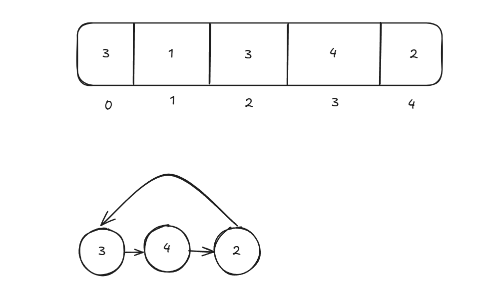

# Repeating Element

## Problem Statement

Given an array of integers `nums` containing `n + 1` integers where each integer is in the range `[1, n]` inclusive.

There is only **one repeated number** in `nums`, return this repeated number.

You must solve the problem **without** modifying the array `nums` and using only constant extra space.

## Key Idea

This algorithm uses **Floyd's Tortoise and Hare Cycle Detection** method, commonly used in linked lists, but cleverly applied to arrays.

- Treat the array like a **linked list**, where:
  - The index represents the node.
  - The value at each index represents the pointer to the next node (`arr[i] → arr[arr[i]]`).
- Since there's one duplicate, a **cycle must form** in this “list”. Because suppose we are at an index which has value 3, we move to element at index 3, now if 3 appears again later on in the array we would traverse back. That's when cycle occurs
- The **duplicate number is the entry point** of the cycle.



## Step by Step Algorithm

**Step 1**: Simulate two pointers

- Let both slow and fast start with value at index 0.
- Move slow by 1 step (`slow = arr[slow]`),
- Move fast by 2 steps (`fast = arr[arr[fast]]`).
- Repeat until they meet. This confirms a cycle exists.

**Step 2**: Find start of the cycle

- Reset `slow` to the start (`arr[0]`).
- Now move both `slow` and `fast` by 1 step until they meet again.
- The meeting point is the entry point of the cycle, which corresponds to the duplicate number.

## Implementation

```java
public int findDuplicate(int[] arr) {
    int slow = arr[0];
    int fast = arr[0];

    do {
        slow = arr[slow];
        fast = arr[arr[fast]];
    }while(slow != fast);

    slow = arr[0];
    while(slow != fast) {
        slow = arr[slow];
        fast = arr[fast];
    }

    return slow;
}
```

## Modifications needed when Array is in Range [0, n-1]

**There are two problems if array contains a zero**:

- When zero is at the starting index:
  - It will create a self loop and we won't be able to visit other elements.
- When zero is at a non-zero index:
  - It will create a loop too early.

**Solution**:

- To safely use Floyd’s algorithm when the values are from [0, n-1], shift all values by +1 during traversal
- Return `slow - 1` at the end.

## Updated Code

```java
public int findDuplicate(int[] arr) {
    int slow = arr[0] + 1;
    int fast = arr[0] + 1;

    do {
        slow = arr[slow] + 1;
        fast = arr[arr[fast]] + 1;
    }while(slow != fast);

    slow = arr[0];
    while(slow != fast) {
        slow = arr[slow] + 1;
        fast = arr[fast] + 1;
    }

    return slow - 1;
}
```
